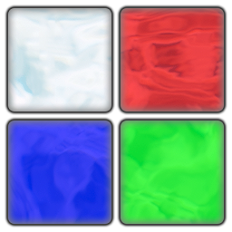
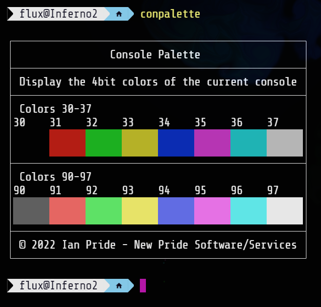
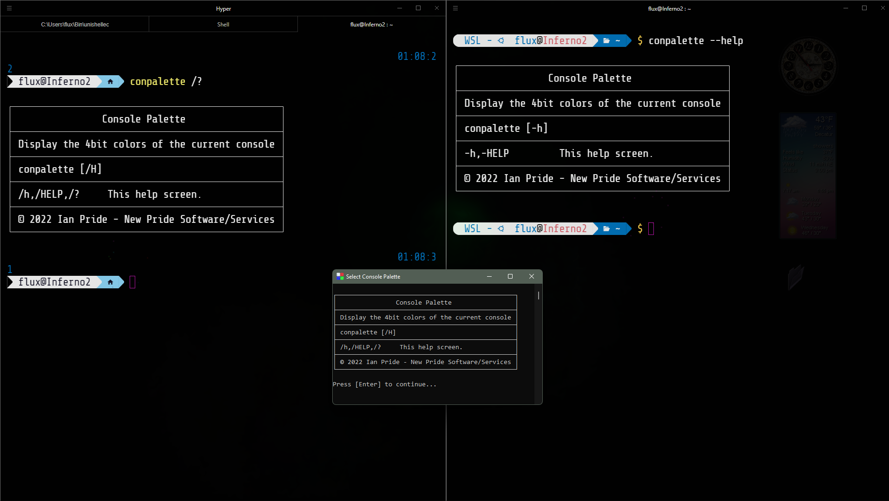

# Console Palette

Display the 4bit colors of the current console&#46;

- [Console Palette](#console-palette)
  - [About](#about)
    - [Description](#description)
    - [Motivation](#motivation)
    - [Where To Get](#where-to-get)
  - [Usage](#usage)
    - [Environment and Information](#environment-and-information)
    - [Examples](#examples)
  - [MD5 Information](#md5-information)
    - [Current Windows X86 MD5](#current-windows-x86-md5)
    - [Current Windows X64 MD5](#current-windows-x64-md5)
    - [Current Linux MD5](#current-linux-md5)
    - [Current Debian MD5](#current-debian-md5)
    - [Current MacOs MD5](#current-macos-md5)
    - [Current Android 32 Bit MD5](#current-android-32-bit-md5)
    - [Current Android 64 Bit MD5](#current-android-64-bit-md5)
  - [Media](#media)
    - [Logo](#logo)
    - [Help Screen](#help-screen)
    - [Demo Screen](#demo-screen)
  - [LICENSE](#license)

---

## About

All about this program and project&#46;

### Description

  
What is this&#63;

  

  This is a console tool for the <b>Windows</b>&#44; <b>Linux</b>&#44; <b>MacOS</b>&#44; and <b>Android</b> &#40;<i>Termux</i>&#41; command line environment to help display the 4bit color scheme of the current console&#46;
  

### Motivation

  
Why did I write this&#63;

  

    Just a fun little tool for when I want to view the current theme for use when working on other themes and scripts&#46;
  

### Where To Get

  
Download or build&#46;

  

  You can fork this repository and build yourself or you can download it at the current <a href="https://github.com/Lateralus138/conpalette/releases">Releases</a> page&#46;

  You can &#40;as with any of my projects&#41; fork and build this project yourself in keeping with the provided <a href="#LICENSE" >LICENSE</a> below.
  

---

## Usage

Where and how to use this program&#46;

### Environment and Information

 

  
Where do I use this&#63;

  

  Like any cli tool &#40;or any executable for that matter&#41; this can be used in any available command line program&#47;emulator in <b>Windows</b> like <b>CMD</b> or <b>PowerShell</b>&#44; for example&#44; and should work in most available terminals&#46;
  
  This is a cross&#45;platform program and has been compiled for Windows&#44; Linux&#44; MacOS&#44; and Android &#40;Termux&#41;&#44; but the source is readily available and can be more than likely be built for most platforms&#46;

  The MacOs version has not been tested well &#40;only in a CI&#41; so if there any issues and you are in a direct MacOs environment and want to fork and work on the project yourself and or contribute to this project then you are free to do so as per the license provided&#46;

  Like any portable program in this can either be placed somewhere in your <code>%PATH%</code> and if not then when your run it you&#39;ll need to provide the direct path of the executable&#46;
  

  <h4>Example Given</h4>
  <pre>
    <code> > & &#39;C:\Users\&#60;USERNAME&#62;\Bin\conpalette.exe&#39; /&#63; </code>
  </pre>

### Examples

  
CMD/PowerShell Examples&#46;

  
Get the current color scheme&#46;

  

---

## MD5 Information

This information is generated in a *GitHub Action* immediately after the successful build of this project.

### Current Windows X86 MD5

### Current Windows X64 MD5

### Current Linux MD5

### Current Debian MD5

### Current MacOs MD5

### Current Android 32 Bit MD5

### Current Android 64 Bit MD5

---

## Media

### Logo

  
Logo, the icon for this program&#46; 

  

### Help Screen

  
Help, screenshot of the help screen&#46; 

  

### Demo Screen

  
Demonstration&#46; 

  

---

## [LICENSE](./LICENSE)

****

  
License Excerpt

   
  <blockquote>
  This program is free software&#58; you can redistribute it and&#47;or modify it under the terms of the GNU General Public License as published by the Free Software Foundation&#44; either version 3 of the License&#44; or &#40;at your option&#41; any later version&#46;
  </blockquote>
   
  <blockquote>
  This program is distributed in the hope that it will be useful&#44; but WITHOUT ANY WARRANTY&#59; without even the implied warranty of MERCHANTABILITY or FITNESS FOR A PARTICULAR PURPOSE&#46;  See the GNU General Public License for more details&#46;
  </blockquote>

